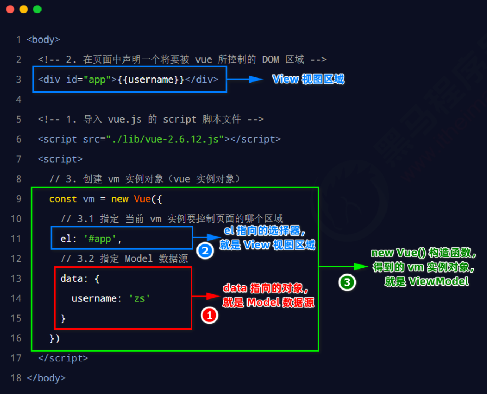

**1. 指令的概念**

指令（Directives）是 vue 为开发者提供的模板语法，用于辅助开发者渲染页面的基本结构。

vue 中的指令按照不同的用途可以分为如下 6 大类：

① 内容渲染指令

② 属性绑定指令

③ 事件绑定指令

④ 双向绑定指令

⑤ 条件渲染指令

⑥ 列表渲染指令


**1.1 内容渲染指令**

内容渲染指令用来辅助开发者渲染 DOM 元素的文本内容。常用的内容渲染指令有如下 3 个：

- v-text : 会覆盖元素内部原有的内容！

- {{ }} : 在实际开发中用的最多，只是内容的占位符，不会覆盖原有的内容！
  - 只能用在元素的内容节点中，不能用在属性节点中
  - 差值中可以作简单的方法

- v-html : 可以把带有标签的字符串，渲染成真正的 HTML 内容！


**v-text**

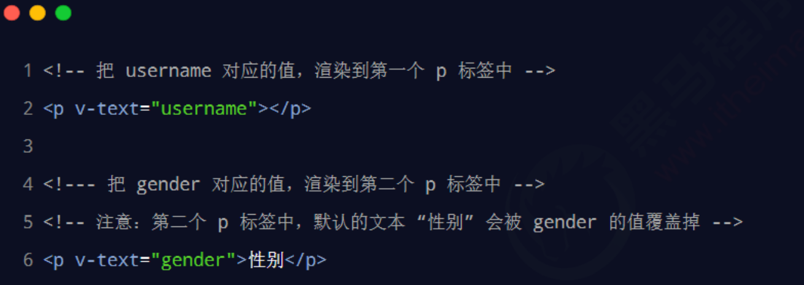

注意：v-text 指令会覆盖元素内默认的值。


**{{ }} 语法**

vue 提供的 {{ }} 语法，专门用来解决 v-text 会覆盖默认文本内容的问题。这种 {{ }} 语法的专业名称是插值表达

式（英文名为：Mustache）。

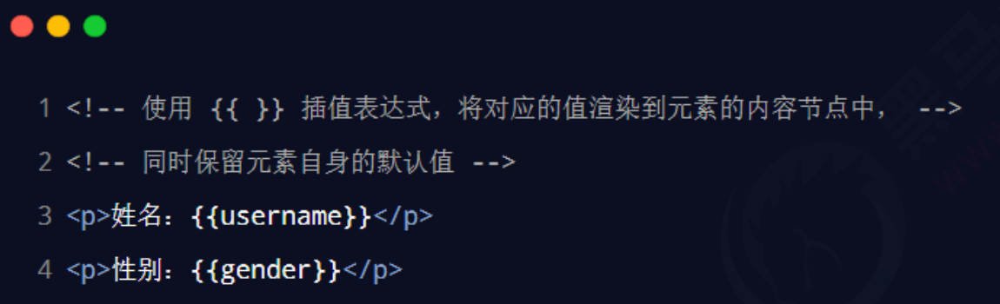

注意：相对于 v-text 指令来说，**插值表达式在开发中更常用一些！**因为它不会覆盖元素中默认的文本内容。

在 vue 提供的模板渲染语法中，除了支持绑定简单的数据值之外，还支持 Javascript 表达式的运算，例如：

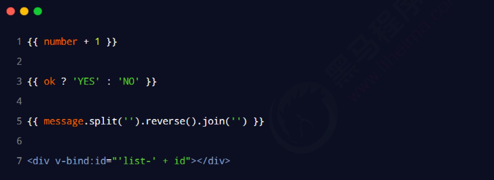

**v-html**

v-text 指令和插值表达式只能渲染纯文本内容。如果要把包含 HTML 标签的字符串渲染为页面的 HTML 元素，

则需要用到 v-html 这个指令：

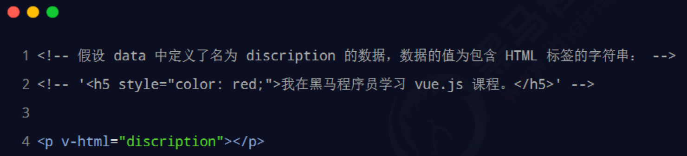


```html
<!DOCTYPE html>
<html lang="en">
<head>
    <meta charset="UTF-8">
    <meta http-equiv="X-UA-Compatible" content="IE=edge">
    <meta name="viewport" content="width=device-width, initial-scale=1.0">
    <title>Document</title>
</head>
<body>
    <div id="app">
        <p v-text = "username"></p>
        <p v-text = "gender">性别：</p>

        <hr>
        <p>{{ username }}</p>
        <p>性别：{{ gender }}</p>
        <hr>
        <p v-text = "info"></p>
        <p>{{ info }}</p>
        <p v-html = "info"></p>
    </div>

    <!-- 导入Vue的库文件 -->
    <script src="./lib/vue-2.6.12.js"></script>
    <!-- 创建Vue的实例对象 -->
    <script>
        const vm = new Vue({
            //告诉vm要控制哪个区域
            el: '#app',
            //data 要渲染的页面上的数据
            data: {
                username: 'zhangsan',
                gender: '女',
                info: '<h4 style="color:red; font-weight: bold;">欢迎来到黑马学习 vue.js</h4>'
            }
        });
    </script>
</body>
</html>
```

**1.2 属性绑定指令**

- v-bind ：可以动态的绑定属性值
  - 可以简写成 :   

如果需要为元素的属性动态绑定属性值，则需要用到 v-bind 属性绑定指令。用法示例如下：

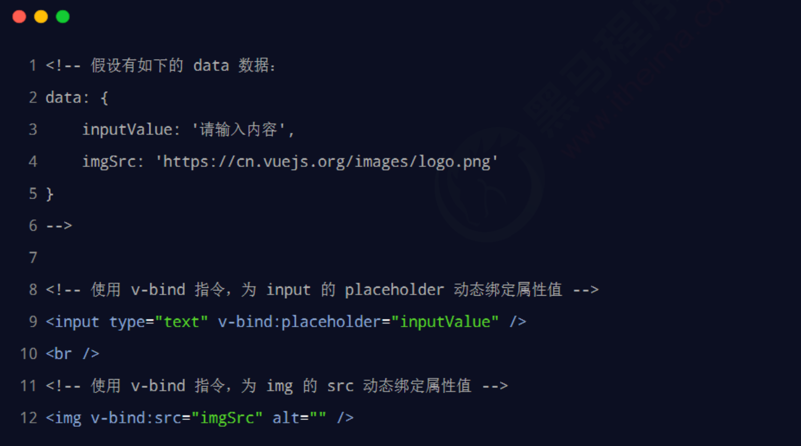

```html
<!DOCTYPE html>
<html lang="en">
<head>
    <meta charset="UTF-8">
    <meta http-equiv="X-UA-Compatible" content="IE=edge">
    <meta name="viewport" content="width=device-width, initial-scale=1.0">
    <title>Document</title>
</head>
<body>
    <div id="app">
        <input type="text" :placeholder="tips">

        <hr>

        
    </div>

    <!-- 导入Vue的库文件 -->
    <script src="./lib/vue-2.6.12.js"></script>
    <!-- 创建Vue的实例对象 -->
    <script>
        const vm = new Vue({
            //告诉vm要控制哪个区域
            el: '#app',
            //data 要渲染的页面上的数据
            data: {
                tips: '姓名',
                photo: 'https://cn.vuejs.org/images/logo.svg'
            }
        });
    </script>
</body>
</html>
```


**1.3事件绑定指令**

-  v-on 

vue 提供了 v-on 事件绑定指令，用来辅助程序员为 DOM 元素绑定事件监听。语法格式如下：

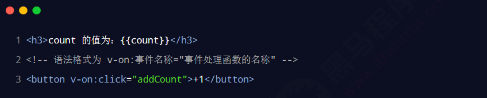

注意：原生 DOM 对象有 onclick、oninput、onkeyup 等原生事件，替换为 vue 的事件绑定形式后，

分别为：v-on:click、v-on:input、v-on:keyup


通过 v-on 绑定的事件处理函数，需要在 methods 节点中进行声明：

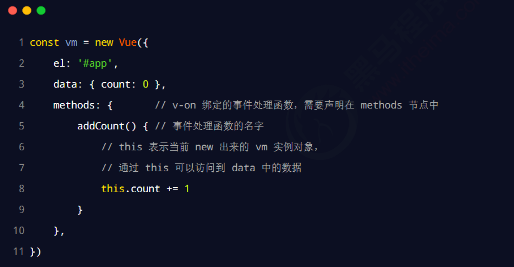


**事件绑定的简写形式**

由于 v-on 指令在开发中使用频率非常高，因此，vue 官方为其提供了简写形式（简写为英文的 **@** ）。

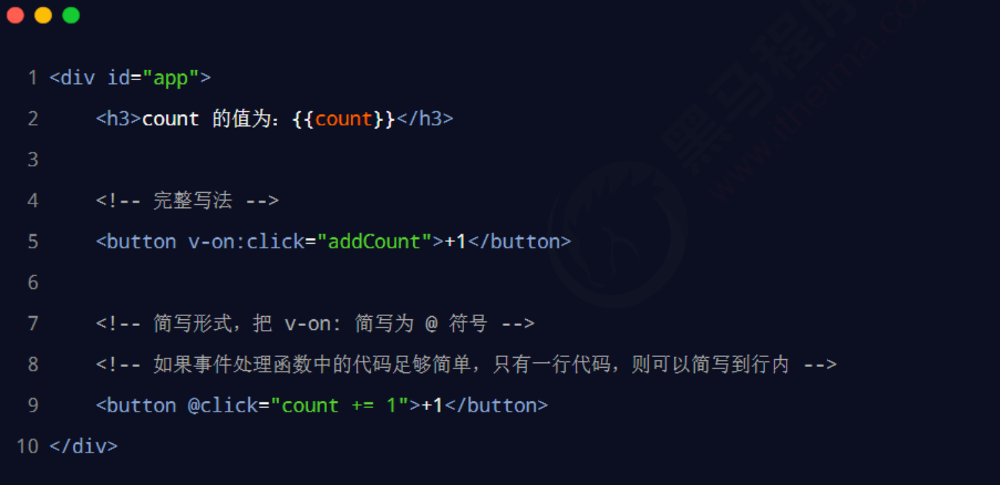

在原生的 DOM 事件绑定中，可以在事件处理函数的形参处，接收事件参数对象 event。同理，在 v-on 指令

（简写为 @ ）所绑定的事件处理函数中，同样可以接收到事件参数对象 event，示例代码如下：

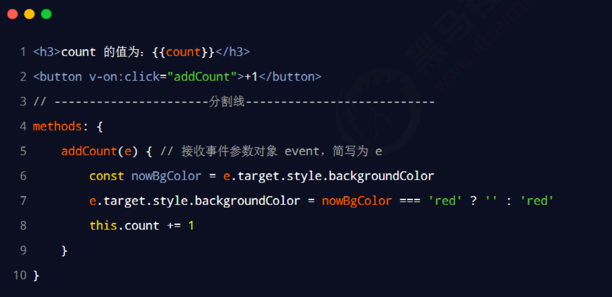

**绑定事件并传参**

在使用 v-on 指令绑定事件时，可以使用 **( )** 进行传参，示例代码如下：

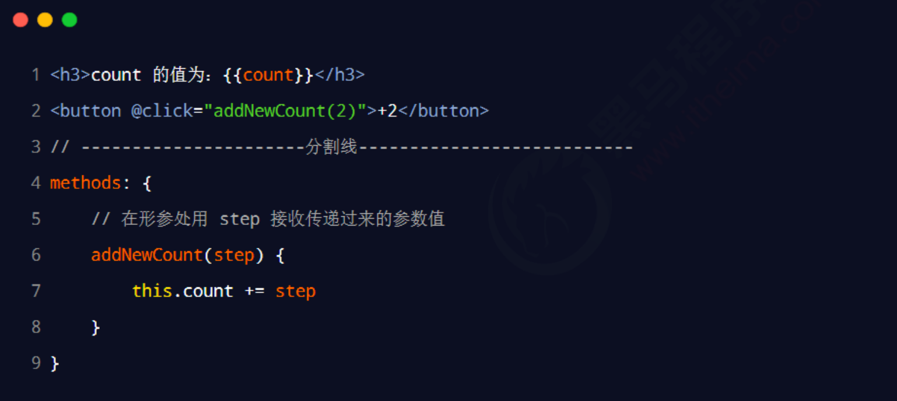

**$event**

$event 是 vue 提供的特殊变量，用来表示原生的事件参数对象 event。$event 可以解决事件参数对象 event 

被覆盖的问题。示例用法如下：

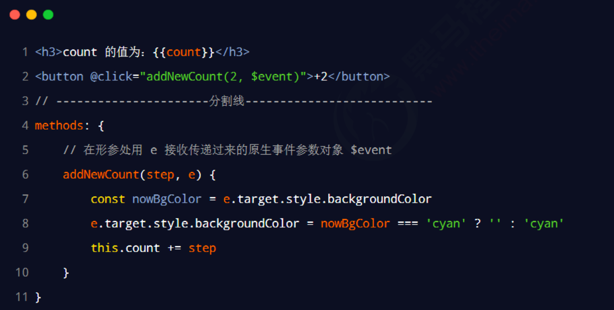


**事件修饰符**

在事件处理函数中调用 event.preventDefault() 或 event.stopPropagation() 是非常常见的需求。因此，

vue 提供了事件修饰符的概念，来辅助程序员更方便的对事件的触发进行控制。常用的 5 个事件修饰符如下

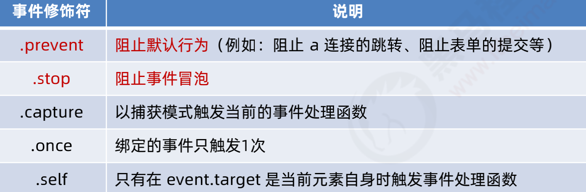

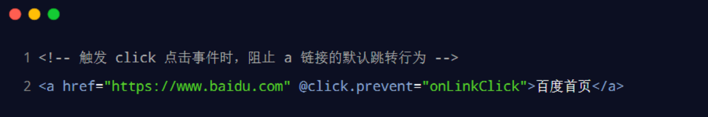


**按键修饰符**

在监听键盘事件时，我们经常需要判断详细的按键。此时，可以为键盘相关的事件添加按键修饰符，例如：

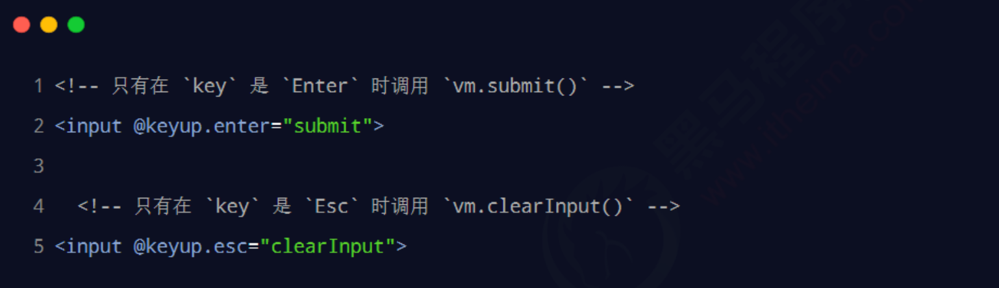


**v-model 指令的修饰符**

为了方便对用户输入的内容进行处理，vue 为 v-model 指令提供了 3 个修饰符，分别是：

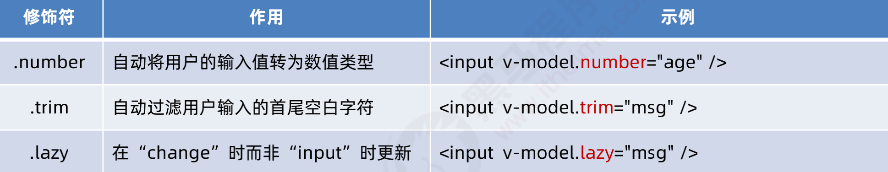

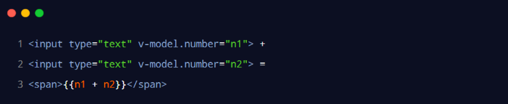


**1.5 条件渲染指令**

条件渲染指令用来辅助开发者按需控制 DOM 的显示与隐藏。条件渲染指令有如下两个，分别是：

- v-if

-  v-show

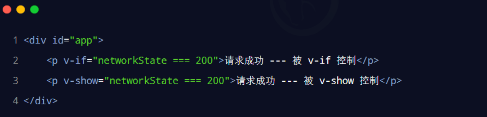

**v-if 和 v-show 的区别**

实现原理不同：

- v-if 指令会动态地创建或移除 DOM 元素，从而控制元素在页面上的显示与隐藏；

- v-show 指令会动态为元素添加或移除 style="display: none;" 样式，从而控制元素的显示与隐藏；


性能消耗不同：

v-if 有更高的切换开销，而 v-show 有更高的初始渲染开销。因此：

-  如果需要非常频繁地切换，则使用 v-show 较好

- 如果在运行时条件很少改变，则使用 v-if 较好


**v-else**

v-if 可以单独使用，或配合 v-else 指令一起使用：

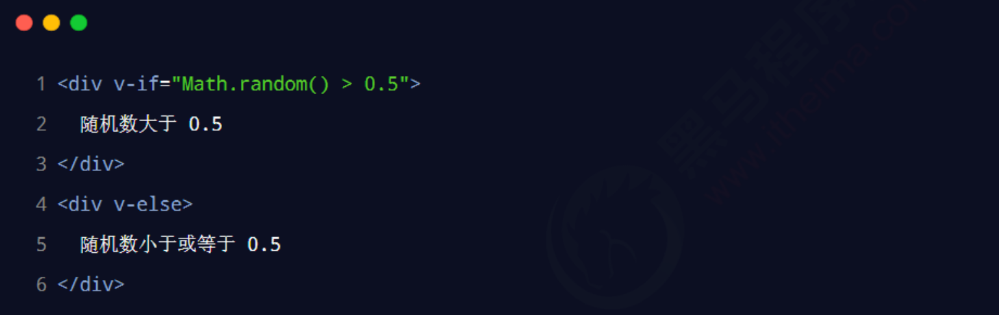

注意：v-else 指令必须配合 v-if 指令一起使用，否则它将不会被识别！

**v-else-if**

v-else-if 指令，顾名思义，充当 v-if 的“else-if 块”，可以连续使用：

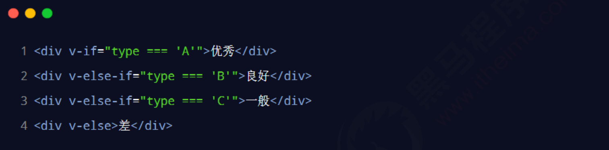

注意：v-else-if 指令必须配合 v-if 指令一起使用，否则它将不会被识别！


**1.6 列表渲染指令**

vue 提供了 v-for 列表渲染指令，用来辅助开发者基于一个数组来循环渲染一个列表结构。v-for 指令需要使

用 item in items 形式的特殊语法，其中：

-  items 是待循环的数组

-  item 是被循环的每一项

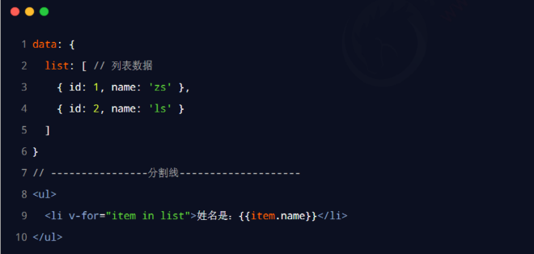

**v-for 中的索引**

v-for 指令还支持一个可选的第二个参数，即当前项的索引。语法格式为 (item, index) in items，示例代码如下：

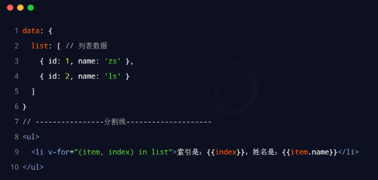

**使用 key 维护列表的状态**

当列表的数据变化时，默认情况下，vue 会尽可能的复用已存在的 DOM 元素，从而提升渲染的性能。但这种

默认的性能优化策略，会导致有状态的列表无法被正确更新。

为了给 vue 一个提示，以便它能跟踪每个节点的身份，从而在保证有状态的列表被正确更新的前提下，提升渲

染的性能。此时，需要为每项提供一个唯一的 key 属性：

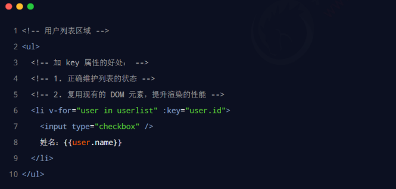
